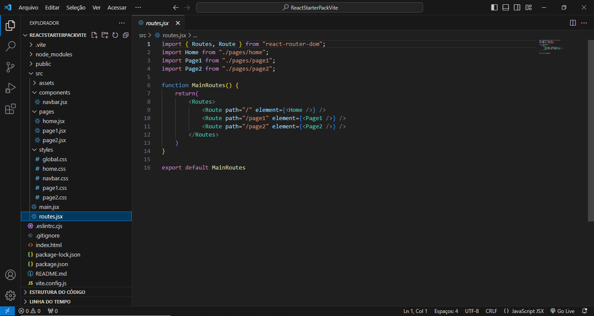

# ReactStarterPackVite



## 📝 Description

**React + Vite Starter-Pack** I created this project with the aim of easing the start of new applications using React + Vite. This project comes pre-configured with react-router-dom for page routing, organization of components, pages, and initial stylings.

## ✨ Technologies Used

<details><summary><b>ReactStarterPackVite</b> is built using the following technologies:</summary>

- [Vite](https://vitejs.dev/)
- [React.js](https://reactjs.org/)
- [Node.js](https://nodejs.org/en)

</details><br/>

## 🧰 Get Started

To get this project up and running in your development environment, follow these step-by-step
instructions.

### 📋 Prerequisites

In order to install and run this project locally, you would need to have the following installed on
your local machine.

- [Node.js](https://nodejs.org/en/)
- [NPM](https://www.npmjs.com/get-npm)
- [Git](https://git-scm.com/downloads)

### ⚙️ Installation and Run Locally

**Step 1:**

Download or clone this repo by using the link below:

```bash
git clone https://github.com/gabrielrbarbosa23/ReactStarterPackVite.git
```

**Step 2:**

Execute the following command in the root directory of the downloaded repo in order to install
dependencies:

```bash
npm install
```

**Step 3:**

Execute the following command in order to run the development server locally:

```bash
npm run dev
```

**Step 4:**

Open [http://localhost:5173](http://localhost:5173) with your browser to see the result.

## 📞 Contact

[](https://www.linkedin.com/in/gabriel-rabello-barbosa-204aa7142/)
[](https://www.instagram.com/gabrielrbarbosa/)